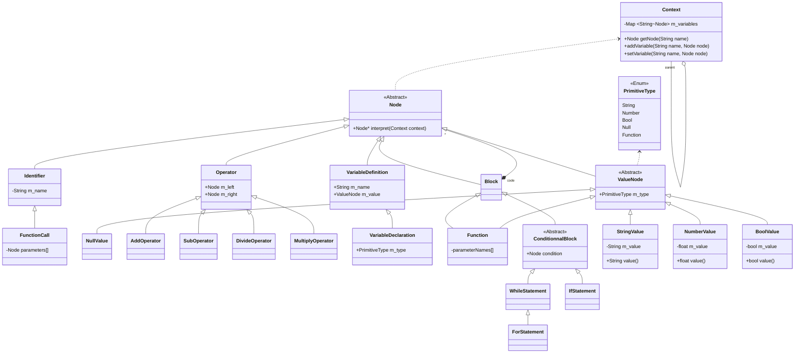

# The Bor Programming Langage

This is just a language because I want to learn how to create my own.

## Specifications

- Typed variables and function
- Primitive types are value type
- Other types are referenced type
- Functions can be stored in variables because everything is a node
- Everything is true except 0 or Null
- Get variable is ascendant, if we can get a variable in the current context, we get it from above
- During compilation, node of function are put in global context
- Number are float

## Grammar


```
PROGRAM -> BLOCK
INSTRUCTION -> E\n | FUNCTION_DEFINITION\n | E\nINSTRUCTION | FUNCTION_DEFINITION\nINSTRUCTION

VARIABLE_DECLARATION -> PRIMITIVE_TYPE VARIABLE_DEFINITION | PRIMITIVE ID
VARIABLE_DEFINITION -> ID = E

FUNCTION_DECLARATION -> PRIMITIVE_TYPE ID(PARAMS_PROTOTYPE) BLOCK
PARAMS_PROTOTYPE -> PRIMITIVE_TYPE | PRIMITIVE_TYPE, PARAMS_PROTOTYPE
BLOCK -> { INSTRUCTION }

// Operators
E -> T + MATH_EXP | T - MATH_EXP | T | - T | + T | BOOL
T -> F* T | F / T | F
F -> NUMBER | ID | FUNCTION_CALL | (MATH_EXP) | undefined | LITERAL


// Compare Operators
DIFF -> E != E
EQ -> E == E
LO -> MATH_EXP < MATH_EXP
LE -> MATH_EXP <= MATH_EXP
GE -> MATH_EXP >= MATH_EXP
GR -> MATH_EXP > MATH_EXP

// Increment and Decrement Operators
INC -> NUMBER += NUMBER
DEC -> NUMBER -= NUMBER

//Boolean Operators
BOOL_EXP -> AND | OR | NOT
AND -> BOOL && BOOL
OR -> BOOL || BOOL
NOT -> !BOOL

FUNCTION_CALL -> ID(PARAMS)
PARAMS -> E | E, PARAMS

ID -> [a-zA-Z0-9_-]*[a-zA-Z_]+[a-zA-Z0-9_]*

// Statement
// if
// while
// for

// Primitive type
LITERAL -> "[.*]"
NUMBER -> [0-9]+(\.[0-9]+)?
BOOL -> True | False

PRIMITIVE_TYPE -> number | bool | string | function | void
```

## Class Diagram

Class diagram of the AST.

