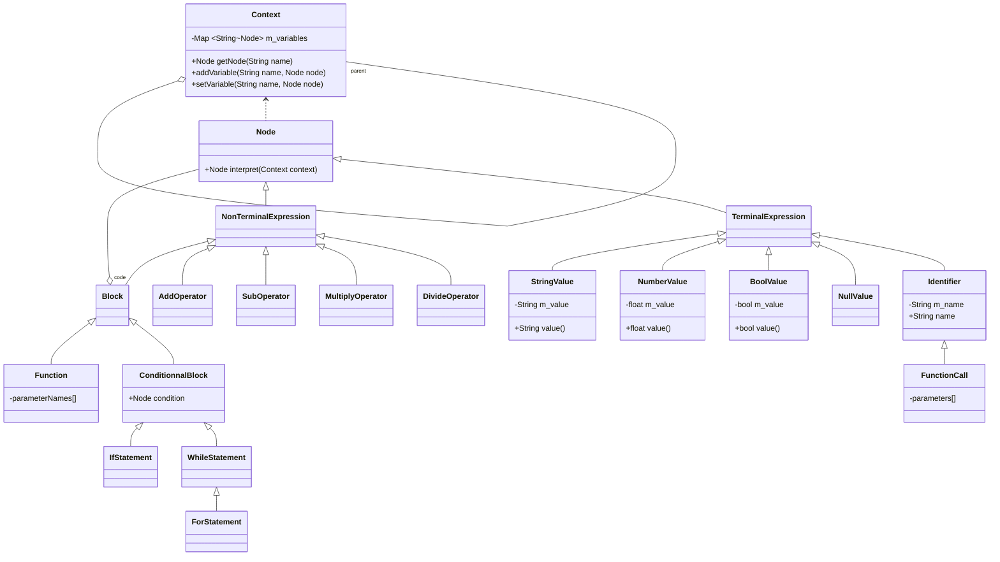

# The Bor Programming Langage

This is just a language because I want to learn how to create my own.

## Specifications

- Typed variables and function
- Primitive types are value type
- Other types are referenced type
- Functions can be stored in variables
- Everything is true except 0 or Null
- Get variable is ascendant, if we can get a variable in the current context, we get it from above
- During compilation, node of function or put in global context

## Class Diagram

Class diagram of the AST.

